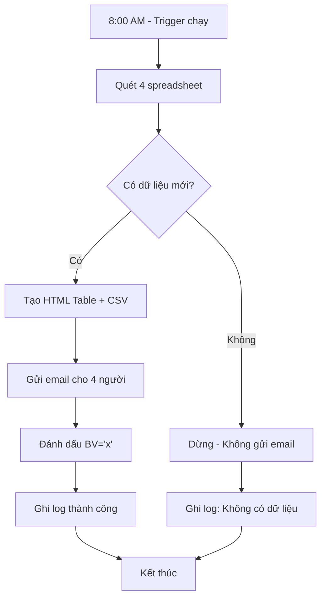

# Hệ thống thông báo Dashboard tự động - Logic và Workflow

## Tổng quan
Hệ thống tự động theo dõi và thông báo các công ty cần bổ sung vào Dashboard trong vòng 14 ngày, sử dụng Google Sheets + Apps Script + Email.

---

## 1. Logic cột "nam trong 14 ngay toi" (BU)

### Công thức Google Sheets
```excel
=IF(AH2="Đã khám xong", "",
  IF(
    AND(
      (TODAY() - WEEKDAY(TODAY(), 2) + 5 + 14) >= J2,
      (TODAY() - WEEKDAY(TODAY(), 2) + 5 + 14) <= K2
    ),
    "x",
    ""
  )
)
```

### Giải thích từng thành phần

#### A. Tính ngày mốc chuẩn
```excel
(TODAY() - WEEKDAY(TODAY(), 2) + 5 + 14)
```

**Chia nhỏ:**
1. `TODAY()` - Ngày hiện tại
2. `WEEKDAY(TODAY(), 2)` - Thứ trong tuần (Thứ 2 = 1, ..., CN = 7)
3. `TODAY() - WEEKDAY(TODAY(), 2)` - Ngày thứ 2 đầu tuần hiện tại
4. `+ 5` - Chuyển sang thứ Sáu (Thứ 2 + 5 = Thứ 7 = Thứ Sáu)
5. `+ 14` - Cộng thêm 14 ngày

**Kết quả:** Ngày thứ Sáu của tuần sau 2 tuần

#### B. Điều kiện kiểm tra
```excel
AND(
  ngày_mốc >= J2,    // Ngày mốc >= Ngày bắt đầu khám
  ngày_mốc <= K2     // Ngày mốc <= Ngày kết thúc khám
)
```

**Ý nghĩa:** Kiểm tra ngày mốc có NẰM TRONG khoảng khám không

#### C. Điều kiện loại trừ
```excel
IF(AH2="Đã khám xong", "", ...)
```
**Ý nghĩa:** Bỏ qua các công ty đã hoàn thành khám

### Ví dụ minh họa

**Giả sử hôm nay: 06/08/2025 (Thứ 4)**
- Thứ 2 đầu tuần: 04/08/2025
- Thứ 6 tuần hiện tại: 08/08/2025  
- **Ngày mốc = 08/08/2025 + 14 = 22/08/2025**

| Công ty | Ngày bắt đầu (J) | Ngày kết thúc (K) | Trạng thái (AH) | Kết quả BU | Giải thích |
|---------|------------------|-------------------|-----------------|------------|------------|
| A | 20/08/2025 | 25/08/2025 | | ✅ "x" | 22/08 nằm trong [20/08, 25/08] |
| B | 15/08/2025 | 20/08/2025 | | ❌ "" | 22/08 > 20/08 (sau khi kết thúc) |
| C | 25/08/2025 | 30/08/2025 | | ❌ "" | 22/08 < 25/08 (chưa bắt đầu) |
| D | 22/08/2025 | 22/08/2025 | | ✅ "x" | 22/08 = 22/08 (đúng ngày) |
| E | 20/08/2025 | 25/08/2025 | Đã khám xong | ❌ "" | Đã hoàn thành |

---

## 2. Logic Apps Script - Workflow tự động

### Kiến trúc hệ thống
```
┌─────────────────┐    ┌──────────────────┐    ┌─────────────────┐
│   4 Spreadsheets │───▶│   Apps Script    │───▶│   Email System  │
│   (Google Sheets)│    │   (Daily Scan)   │    │   (Multi users) │
└─────────────────┘    └──────────────────┘    └─────────────────┘
         │                        │                        │
         ▼                        ▼                        ▼
┌─────────────────┐    ┌──────────────────┐    ┌─────────────────┐
│ BU="x" & BV≠"x" │    │ Data Processing  │    │ CSV Attachment  │
│ (Điều kiện lọc) │    │ & HTML Table     │    │ + Update BV="x" │
└─────────────────┘    └──────────────────┘    └─────────────────┘
```

### Các bước xử lý chi tiết

#### Bước 1: Quét dữ liệu từ 4 spreadsheet
```javascript
var spreadsheetIds = [
  "15ZO4BGyOkHMyPIttE4BBVvaZhJbmqTTJ5jKWsHLfQfg",
  "1L1wIc5gVEh4hz1mfVorGF48vfEGQnZ6VBXGcndxRlwA", 
  "10CJ8qC028-CbX1UjmI-HcbPkQxRoiWFKPXlDT8f5uSY",
  "13ACyogQDDBRw9QEZc0YQ42Qis5Z_yVNOu7WmS67TWVw"
];
```

**Logic:**
- Mở từng spreadsheet theo ID
- Tìm sheet "file nhap chc" trong mỗi file
- Lấy toàn bộ dữ liệu từ sheet

#### Bước 2: Tìm vị trí cột động
```javascript
var header = data[0];
var COL_BU = header.indexOf("nam trong 14 ngay toi");
var COL_BV = header.indexOf("da gui mail");
var COL_O  = header.indexOf("ten nhan vien");
// ... các cột khác
```

**Ưu điểm:** Không phụ thuộc vào vị trí cột cố định, tự động tìm theo tên tiêu đề.

#### Bước 3: Lọc dữ liệu cần gửi
```javascript
if (bu === "x" && bv !== "x") {
  // Thêm vào danh sách gửi
  allRowsToSend.push([...]);
  // Lưu thông tin để update sau
  allUpdates.push({...});
}
```

**Điều kiện:**
- `BU = "x"`: Công ty nằm trong khoảng 14 ngày
- `BV ≠ "x"`: Chưa gửi thông báo (tránh gửi trùng)

#### Bước 4: Xử lý và định dạng dữ liệu
```javascript
// Định dạng ngày: DD/MM/YYYY
formatDate(data[i][COL_J])

// Làm tròn số: Không phần thập phân
roundNumber(data[i][COL_AV])
```

#### Bước 5: Tạo nội dung email
**HTML Table:** Hiển thị trực tiếp trong email
**CSV File:** Đính kèm file để lưu trữ, phân tích

#### Bước 6: Gửi email
```javascript
MailApp.sendEmail({
  to: "email1@domain.com,email2@domain.com",
  subject: "[Thông báo P.KD] Danh sách công ty bổ sung Dashboard trong 14 ngày",
  htmlBody: body,
  attachments: [csvBlob]
});
```

#### Bước 7: Đánh dấu đã gửi
```javascript
// Đánh dấu "x" vào cột BV của tất cả dòng đã gửi
for (var u = 0; u < allUpdates.length; u++) {
  updateSheet.getRange(rowIndex, colIndex).setValue("x");
}
```

---

## 3. Cấu trúc dữ liệu

### Input (từ Google Sheets)
| Cột | Tên cột | Mô tả | Ví dụ |
|-----|---------|-------|-------|
| O | ten nhan vien | NVKD phụ trách | "Bùi Thị Như Quỳnh" |
| U | ten cong ty | Tên công ty khám | "CÔNG TY CỔ PHẦN ABC" |
| J | ngay bat dau kham | Ngày bắt đầu khám | 20/08/2025 |
| K | ngay ket thuc kham | Ngày kết thúc khám | 25/08/2025 |
| G | so nguoi kham | Số người tham gia | 150 |
| AU | tong so ngay kham thuc te | Tổng ngày khám | 5 |
| AV | trung binh ngay | Trung bình | 2.5 → 3 |
| BU | nam trong 14 ngay toi | Đánh dấu tự động | "x" hoặc "" |
| BV | da gui mail | Đánh dấu đã gửi | "x" hoặc "" |

### Output (Email + CSV)
```
NVKD: Bùi Thị Như Quỳnh
Công ty: CÔNG TY CỔ PHẦN ABC
Ngày bắt đầu: 20/08/2025
Ngày kết thúc: 25/08/2025
Số người khám: 150
Tổng số ngày khám: 5
Trung bình ngày: 3
```

---

## 4. Trigger và Automation

### Cài đặt Trigger
```javascript
// Chạy tự động mỗi ngày lúc 8:00 sáng
// Apps Script > Triggers > Add Trigger
// Function: sendCompanyCheckMail
// Event: Time-driven > Day timer > 8am-9am
```

### Xử lý lỗi
```javascript
try {
  var ss = SpreadsheetApp.openById(spreadsheetIds[s]);
  // Xử lý dữ liệu
} catch (error) {
  Logger.log("Lỗi file " + spreadsheetIds[s] + ": " + error.toString());
  // Tiếp tục với file tiếp theo
}
```

---

## 5. Luồng hoạt động hàng ngày



---

## 6. Ưu điểm của hệ thống

### 🎯 **Tự động hóa hoàn toàn**
- Không cần can thiệp thủ công
- Chạy đúng giờ, đúng ngày
- Không bỏ sót, không gửi trùng

### 📊 **Tích hợp đa nguồn**
- 4 file spreadsheet khác nhau
- 1 email tổng hợp duy nhất
- Dễ mở rộng thêm file mới

### 🔍 **Logic chính xác**
- Tính toán ngày mốc theo tuần
- Lọc đúng khoảng thời gian
- Xử lý ngoại lệ (đã khám xong)

### 📧 **Email chuyên nghiệp**
- HTML table đẹp, dễ đọc
- File CSV đính kèm tiện lợi
- Gửi nhiều người cùng lúc

### 🛡️ **Bảo mật và ổn định**
- Error handling cho từng file
- Log chi tiết để debug
- Không làm rác Google Drive

---

## 7. Bảo trì và mở rộng

### Thêm người nhận email
```javascript
var recipients = "email1@domain.com,email2@domain.com,email3@domain.com";
```

### Thêm spreadsheet mới
```javascript
var spreadsheetIds = [
  "existing_id_1",
  "existing_id_2", 
  "new_spreadsheet_id"  // Thêm ID mới
];
```

### Thay đổi thời gian trigger
- Vào Apps Script > Triggers
- Chỉnh sửa trigger hiện có
- Chọn thời gian mới (ví dụ: 6am-7am)

### Tùy chỉnh nội dung email
```javascript
var subject = "[Thông báo P.KD] Custom subject";
var body = "Custom greeting and content";
```

---

## 8. Troubleshooting

### Không nhận được email
1. ✅ Kiểm tra hộp thư Spam
2. ✅ Xem Apps Script > Executions để check lỗi
3. ✅ Verify email addresses đúng format

### File CSV không mở được
1. ✅ Sử dụng Excel (không phải Notepad)
2. ✅ File có BOM UTF-8 để hiển thị tiếng Việt
3. ✅ Kiểm tra phần mềm anti-virus

### Dữ liệu không chính xác
1. ✅ Kiểm tra tên cột trong sheet (header)
2. ✅ Verify công thức cột BU
3. ✅ Check quyền truy cập các spreadsheet

---

**Tài liệu này cung cấp cái nhìn tổng quan về toàn bộ hệ thống. Để thay đổi hoặc mở rộng, tham khảo từng phần tương ứng.**
