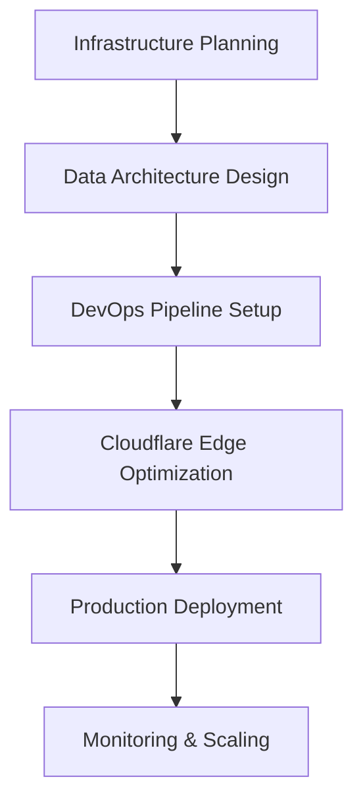

# 🏗️ Infrastructure & Backend Experts

## Tổng quan
Nhóm chuyên gia chuyên về hạ tầng, backend, và data architecture - những người xây dựng nền tảng vững chắc cho toàn bộ hệ thống.

## Danh sách Quantum Experts

### 🔥 Quantum Cloudflare Architect
**Chuyên môn:** Edge computing, CDN optimization, security, performance
- Cloudflare Workers, Pages, KV storage
- DDoS protection và WAF configuration  
- Global load balancing với edge computing
- Performance optimization với caching strategies

### ⚙️ Quantum DevOps Intelligence Architect  
**Chuyên môn:** CI/CD, containerization, infrastructure automation
- Docker, Kubernetes, service mesh architectures
- AWS/Azure/GCP multi-cloud strategies
- Infrastructure-as-Code với Terraform, Ansible
- Monitoring với Prometheus, Grafana, ELK stack

### 🗄️ Quantum Data Architecture Philosopher
**Chuyên môn:** Database design, API architecture, scalable backend systems
- PostgreSQL, MongoDB, Redis optimization
- RESTful APIs, GraphQL, microservices architecture
- Data pipeline engineering với ETL/ELT processes
- Performance optimization với query tuning

## Khi nào sử dụng

### 🎯 Planning Phase
- **Cloudflare Architect**: Thiết kế CDN strategy và edge computing architecture
- **DevOps Architect**: Infrastructure planning với deployment strategy
- **Data Architect**: Database design với API architecture planning

### 🔧 Implementation Phase  
- **DevOps Architect**: CI/CD pipeline setup với container orchestration
- **Data Architect**: Backend development với database optimization
- **Cloudflare Architect**: Edge computing implementation với performance tuning

### 📈 Scaling Phase
- **Data Architect**: Database scaling với microservices migration
- **DevOps Architect**: Infrastructure scaling với auto-scaling implementation
- **Cloudflare Architect**: Global CDN optimization với traffic management

## Workflow Integration

## Best Practices
1. **Security First**: All infrastructure decisions prioritize security
2. **Scalability Planning**: Design cho future growth từ day one  
3. **Performance Optimization**: Every layer optimized cho speed
4. **Cost Consciousness**: Balance performance với cost efficiency
5. **Monitoring Excellence**: Comprehensive observability across all systems
