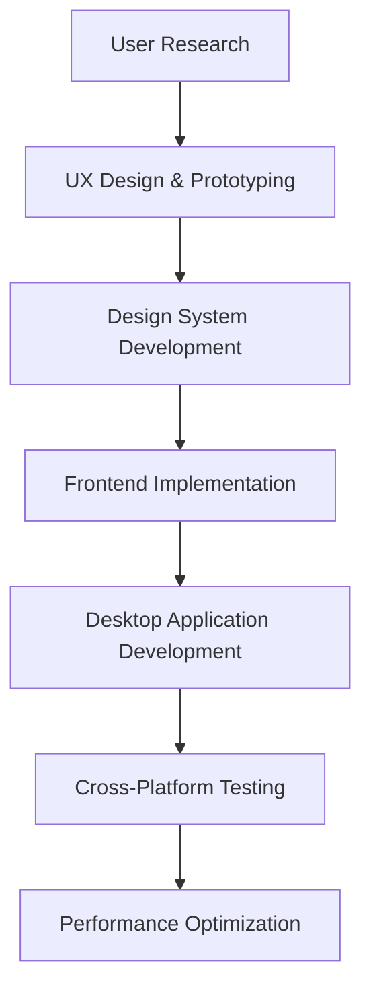

# 🎨 Frontend & User Experience Experts

## Tổng quan
Nhóm chuyên gia tập trung vào frontend development và user experience - những người tạo ra giao diện người dùng đẹp, dễ sử dụng và hiệu suất cao.

## Danh sách Quantum Experts

### 🌐 Quantum Frontend Excellence Architect
**Chuyên môn:** Modern web development, performance optimization
- React/Vue/Angular ecosystem mastery
- Modern CSS, responsive design, design systems
- Performance optimization với Core Web Vitals
- Accessibility excellence với WCAG compliance

### 🎨 Quantum User Experience Philosopher  
**Chuyên môn:** Human-centered design, user research, interaction design
- User research methodologies với behavioral analysis
- Information architecture với navigation design
- Design systems với component libraries
- Accessibility và inclusive design principles

### 💻 Quantum Windows Application Architect
**Chuyên môn:** Native desktop applications, Windows platform optimization
- WPF, UWP, Win32 application development
- Windows 11 design language với Fluent Design
- Performance optimization cho desktop applications
- Native Windows API integration

## Khi nào sử dụng

### 🎯 Design Phase
- **UX Philosopher**: User research, persona development, journey mapping
- **Frontend Architect**: Technical feasibility assessment, framework selection
- **Windows Architect**: Desktop application requirements analysis

### 🎨 Prototyping Phase
- **UX Philosopher**: Wireframing, prototyping, usability testing
- **Frontend Architect**: Component library development, design system implementation
- **Windows Architect**: Native desktop prototype development

### 🚀 Development Phase
- **Frontend Architect**: Web application development với optimization
- **Windows Architect**: Desktop application implementation
- **UX Philosopher**: Continuous user testing và iteration

### 🔍 Testing & Optimization Phase
- **UX Philosopher**: User acceptance testing, accessibility auditing
- **Frontend Architect**: Performance optimization, cross-browser testing
- **Windows Architect**: Desktop performance tuning, Windows integration testing

## Workflow Integration

## Collaboration Framework

### Frontend ↔ UX
- **Shared**: Component libraries, design tokens, interaction patterns
- **Handoff**: Design specifications, prototype interactions, user flows

### Frontend ↔ Windows  
- **Shared**: UI patterns, performance standards, accessibility requirements
- **Integration**: Cross-platform design consistency, shared components

### UX ↔ Windows
- **Shared**: User research insights, usability principles, accessibility standards  
- **Collaboration**: Desktop-specific user patterns, Windows platform conventions

## Best Practices
1. **User-Centric Approach**: Every decision starts với user needs
2. **Performance Consciousness**: Fast, responsive experiences on all platforms
3. **Accessibility First**: Universal design cho all users
4. **Design System Thinking**: Consistent, scalable design patterns
5. **Cross-Platform Consistency**: Unified experience across web và desktop
