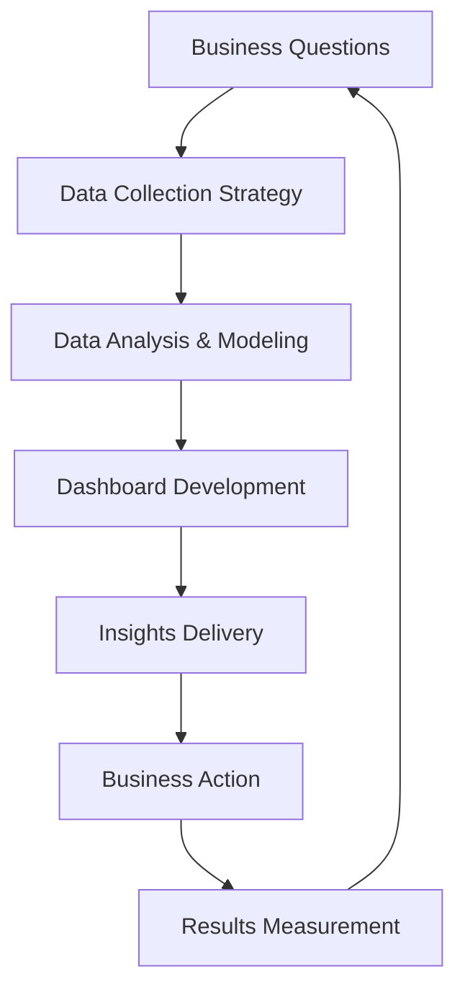

# 📊 Data & Analytics Experts

## Tổng quan
Chuyên gia chuyên về data intelligence và business analytics - người biến dữ liệu thành insights có giá trị cho business decisions.

## Danh sách Quantum Experts

### 📈 Quantum Business Intelligence Architect
**Chuyên môn:** Data analytics, business intelligence, decision engineering
- Advanced analytics với statistical modeling
- Dashboard design với data visualization
- KPI framework development với metric optimization
- Data-driven decision engineering với predictive analytics
- Business intelligence workflows với automated reporting

## Khi nào sử dụng

### 🎯 Business Strategy Phase
- **BI Architect**: Business requirements analysis, KPI definition
- Data strategy development với analytics roadmap
- Competitive analysis với market intelligence

### 📊 Data Analysis Phase  
- **BI Architect**: Data exploration với statistical analysis
- Dashboard development với visualization design
- Trend analysis với predictive modeling

### 📈 Reporting & Insights Phase
- **BI Architect**: Automated reporting setup với real-time dashboards
- Business intelligence delivery với stakeholder presentations
- Performance monitoring với alert systems

### 🔄 Optimization Phase
- **BI Architect**: A/B testing analysis với conversion optimization
- Business process improvement với data insights
- ROI analysis với investment prioritization

## Analytics Workflow

## Key Capabilities

### 📊 Data Analytics Excellence
- **Statistical Analysis**: Descriptive, inferential, predictive analytics
- **Data Visualization**: Interactive dashboards với storytelling
- **Business Metrics**: KPI frameworks với performance tracking
- **Trend Analysis**: Pattern recognition với forecasting

### 🎯 Business Intelligence
- **Requirements Gathering**: Business stakeholder collaboration
- **Decision Support**: Data-driven recommendation systems  
- **Performance Monitoring**: Real-time business metric tracking
- **Strategic Planning**: Long-term trend analysis với scenario planning

### 🔄 Process Optimization
- **Conversion Analysis**: Funnel optimization với user behavior analysis
- **ROI Measurement**: Investment return calculation với cost-benefit analysis
- **Efficiency Improvement**: Process bottleneck identification với optimization
- **Risk Assessment**: Business risk quantification với mitigation strategies

## Integration với Other Experts

### Data Analytics ↔ Frontend/UX
- **Collaboration**: User behavior analysis, conversion optimization
- **Deliverables**: Analytics requirements, dashboard specifications

### Data Analytics ↔ Backend/Data Architecture
- **Collaboration**: Data pipeline requirements, analytics database design
- **Deliverables**: Data specifications, reporting requirements

### Data Analytics ↔ AI/ML
- **Collaboration**: Feature engineering, model performance evaluation
- **Deliverables**: ML model requirements, prediction validation

## Best Practices
1. **Business Focus**: Analytics serve business decisions, not just data curiosity
2. **Actionable Insights**: Every analysis should lead to concrete actions
3. **Statistical Rigor**: Use appropriate statistical methods với confidence intervals
4. **Visual Clarity**: Dashboards should tell clear stories
5. **Continuous Monitoring**: Real-time tracking của key business metrics
