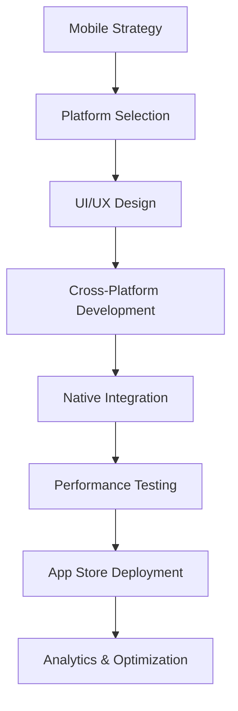

# 📱 Mobile & Cross-Platform Experts

## Tổng quan
Chuyên gia chuyên về mobile development và cross-platform solutions - người tạo ra trải nghiệm mobile exceptional across all devices và platforms.

## Danh sách Quantum Experts

### 📱 Quantum Mobile Excellence Architect
**Chuyên môn:** Cross-platform mobile development, native performance optimization
- Flutter, React Native, native iOS/Android development
- Mobile UI/UX patterns với platform-specific optimizations
- Performance optimization cho mobile devices
- Cross-platform architecture với platform integration
- Mobile DevOps với app store optimization

## Khi nào sử dụng

### 🎯 Mobile Strategy Phase
- **Mobile Architect**: Platform strategy (native vs cross-platform)
- Technology stack selection với team capability assessment
- Mobile-first design approach với responsive considerations

### 📱 Mobile Development Phase
- **Mobile Architect**: Cross-platform application development
- Native feature integration với platform-specific optimizations
- Performance optimization cho diverse device capabilities

### 🚀 Mobile Deployment Phase  
- **Mobile Architect**: App store submission với optimization
- Mobile CI/CD pipeline setup với automated testing
- Performance monitoring với crash reporting

### 📈 Mobile Optimization Phase
- **Mobile Architect**: Performance tuning với battery optimization
- User experience optimization dựa trên analytics
- App store optimization với user acquisition strategies

## Mobile Development Workflow

## Key Capabilities

### 🛠️ Cross-Platform Excellence
- **Flutter Mastery**: Advanced widgets với custom animations
- **React Native**: Native module integration với performance optimization
- **Platform Channels**: Native functionality integration across platforms
- **Code Sharing**: Maximum code reuse với platform-specific customizations

### 📱 Native Development
- **iOS Development**: Swift/SwiftUI với iOS-specific features
- **Android Development**: Kotlin/Jetpack Compose với Android optimizations
- **Platform Integration**: Camera, sensors, notifications, background processing
- **Performance Optimization**: Memory management với battery efficiency

### 🎨 Mobile UX Excellence
- **Platform Guidelines**: Material Design và Human Interface Guidelines
- **Responsive Design**: Adaptive layouts across screen sizes
- **Touch Interactions**: Gesture-based navigation với haptic feedback
- **Accessibility**: Mobile accessibility với assistive technology support

### ⚡ Performance Engineering
- **Launch Performance**: Fast app startup với splash screen optimization
- **Runtime Optimization**: Smooth animations với 60fps performance
- **Memory Management**: Efficient resource usage với leak prevention
- **Network Efficiency**: Offline-first với intelligent data syncing

## Integration với Other Experts

### Mobile ↔ Frontend/UX
- **Collaboration**: Responsive design patterns, cross-platform consistency
- **Deliverables**: Mobile-first designs, component libraries

### Mobile ↔ Backend/API
- **Collaboration**: API optimization cho mobile, offline synchronization
- **Deliverables**: Mobile API requirements, caching strategies

### Mobile ↔ DevOps
- **Collaboration**: Mobile CI/CD pipelines, automated testing
- **Deliverables**: Build configurations, deployment automation

### Mobile ↔ Security
- **Collaboration**: Mobile security implementation, secure storage
- **Deliverables**: Security requirements, compliance validation

## Platform-Specific Considerations

### 🍎 iOS Optimization
- **App Store Guidelines**: Compliance với review process optimization
- **iOS Features**: ARKit, Core ML, Siri integration
- **Performance**: Metal optimization, Core Animation efficiency

### 🤖 Android Optimization  
- **Play Store Policies**: Compliance với Android-specific requirements
- **Android Features**: Camera2, ML Kit, Google Services integration
- **Fragmentation**: Device compatibility với version support

### 🌐 Web Mobile
- **Progressive Web Apps**: PWA với native-like capabilities
- **Mobile Web Performance**: Touch optimization với responsive design
- **Offline Functionality**: Service workers với caching strategies

## Best Practices
1. **Platform Respect**: Honor platform conventions while maintaining brand consistency
2. **Performance First**: Optimize cho smooth user experience on all devices
3. **Offline Capability**: Design cho unreliable network conditions
4. **Battery Consciousness**: Minimize battery drain với background processing
5. **Accessibility Excellence**: Universal design cho all mobile users
