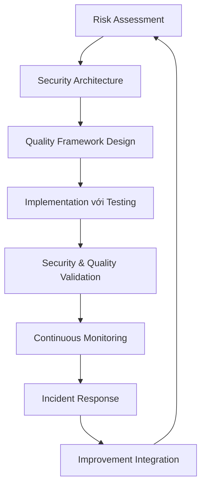

# 🛡️ Security & Quality Assurance Experts

## Tổng quan
Nhóm chuyên gia đảm bảo hệ thống an toàn, đáng tin cậy và chất lượng cao - những người bảo vệ ứng dụng và user data khỏi mọi rủi ro.

## Danh sách Quantum Experts

### 🔒 Quantum Security Intelligence Architect
**Chuyên môn:** Cybersecurity, privacy-by-design, compliance engineering
- Application security với OWASP best practices
- Infrastructure security với zero-trust architecture
- Data protection với GDPR compliance
- Security automation với DevSecOps integration
- Compliance frameworks (ISO27001, SOC2, NIST)

### 🧪 Quantum Quality Intelligence Architect  
**Chuyên môn:** Testing excellence, reliability engineering, quality culture
- Test automation với CI/CD integration
- Performance testing với scalability validation
- Quality engineering với shift-left testing
- Security testing với vulnerability assessment
- Quality culture building với metrics-driven improvement

## Khi nào sử dụng

### 🛡️ Security Planning Phase
- **Security Architect**: Threat modeling, security architecture design
- **Quality Architect**: Quality strategy development, testing framework planning
- Risk assessment với security requirements definition

### 🔍 Implementation Phase
- **Security Architect**: Security controls implementation, DevSecOps integration
- **Quality Architect**: Test automation development, quality gate implementation
- Security testing với quality validation integration

### 🔄 Continuous Monitoring Phase
- **Security Architect**: Security monitoring setup, incident response procedures
- **Quality Architect**: Quality metrics tracking, continuous testing automation
- Performance monitoring với security observability

### 🚨 Incident Response Phase
- **Security Architect**: Security incident management, forensics analysis
- **Quality Architect**: Quality issue root cause analysis, process improvement
- Post-incident learning với prevention strategies

## Security & Quality Workflow

## Security Excellence Framework

### 🔐 Application Security
- **Secure Development**: SAST, DAST, secure coding practices
- **API Security**: Authentication, authorization, rate limiting
- **Data Protection**: Encryption, access controls, privacy preservation
- **Vulnerability Management**: Scanning, assessment, remediation

### 🏰 Infrastructure Security
- **Network Security**: Firewalls, VPNs, network segmentation
- **Cloud Security**: IAM, resource isolation, compliance monitoring
- **Container Security**: Image scanning, runtime protection, RBAC
- **Zero Trust**: Continuous verification, least privilege access

### 📋 Compliance & Governance
- **Regulatory Compliance**: GDPR, CCPA, industry-specific requirements
- **Policy Management**: Security policies, procedures, training
- **Audit Preparation**: Evidence collection, compliance validation
- **Risk Management**: Risk assessment, mitigation strategies, reporting

## Quality Excellence Framework

### 🧪 Test Automation Excellence
- **Unit Testing**: Comprehensive test coverage với framework optimization
- **Integration Testing**: API testing, service integration validation
- **E2E Testing**: User workflow automation với cross-browser testing
- **Performance Testing**: Load testing, stress testing, capacity planning

### 📊 Quality Engineering
- **Shift-Left Testing**: Early quality integration trong development
- **Quality Gates**: Release criteria với automated quality checks
- **Risk-Based Testing**: Priority-driven testing với business impact focus
- **Continuous Testing**: Real-time quality feedback trong CI/CD

### 📈 Quality Culture & Metrics
- **Quality Metrics**: Defect tracking, test effectiveness, quality trends
- **Process Improvement**: Quality process optimization với waste elimination
- **Team Training**: Quality education với best practice sharing
- **Quality Leadership**: Quality culture building với shared responsibility

## Integration với Other Experts

### Security ↔ DevOps
- **Collaboration**: DevSecOps pipeline integration, infrastructure security
- **Deliverables**: Security automation, compliance monitoring

### Quality ↔ Development Teams
- **Collaboration**: Testing framework integration, quality coaching
- **Deliverables**: Test automation, quality guidelines, code review

### Security ↔ Quality
- **Collaboration**: Security testing integration, compliance validation
- **Deliverables**: Security test cases, vulnerability assessment

### Security/Quality ↔ Business
- **Collaboration**: Risk communication, compliance reporting
- **Deliverables**: Risk assessments, quality reports, business impact analysis

## Compliance & Standards

### 🌐 International Standards
- **ISO 27001**: Information security management systems
- **SOC 2**: Security, availability, processing integrity controls
- **NIST Framework**: Cybersecurity framework implementation

### 🇪🇺 Privacy Regulations
- **GDPR**: European data protection regulation compliance
- **CCPA**: California consumer privacy act requirements
- **Local Regulations**: Vietnamese cybersecurity law compliance

### 🏭 Industry-Specific
- **PCI DSS**: Payment card industry security standards
- **HIPAA**: Healthcare data protection requirements
- **Financial Services**: Banking và finance security regulations

## Best Practices
1. **Security by Design**: Build security into architecture từ day one
2. **Shift-Left Approach**: Early integration của security và quality
3. **Continuous Monitoring**: Real-time security và quality visibility
4. **Risk-Based Decisions**: Prioritize based on business risk assessment
5. **Culture Building**: Foster security và quality consciousness across teams
