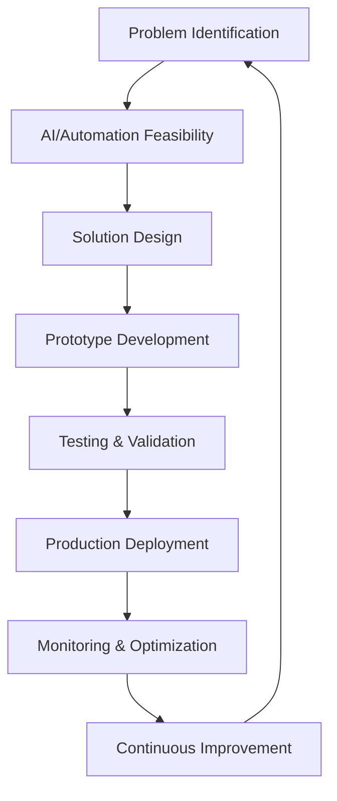

# 🤖 AI & Automation Intelligence Experts

## Tổng quan  
Nhóm chuyên gia leading edge về artificial intelligence và automation - những người biến ý tưởng AI thành practical solutions và automate complex processes.

## Danh sách Quantum Experts

### 🧠 Quantum AI Integration Specialist
**Chuyên môn:** Machine learning implementation, intelligent systems engineering
- LLM integration với prompt engineering excellence
- RAG systems với semantic search optimization
- Computer vision với real-time processing
- MLOps pipelines với model monitoring
- AI ethics với responsible AI development

### ⚙️ Quantum Automation Intelligence Architect
**Chuyên môn:** Process automation, workflow optimization, intelligent systems
- Business process automation với workflow orchestration
- RPA implementation với intelligent decision-making
- System integration với API orchestration
- Performance monitoring với automated optimization
- Scalable automation architectures với event-driven systems

## Khi nào sử dụng

### 🎯 AI Strategy Phase
- **AI Specialist**: AI feasibility assessment, use case identification
- **Automation Architect**: Process analysis, automation opportunity mapping
- Technology selection với implementation roadmap

### 🧪 Prototype & Proof of Concept
- **AI Specialist**: ML model development, AI feature prototyping
- **Automation Architect**: Automation workflow design, integration testing
- Performance validation với user feedback integration

### 🚀 Production Implementation  
- **AI Specialist**: AI system deployment, model serving optimization
- **Automation Architect**: Production automation deployment, monitoring setup
- Scalability testing với performance optimization

### 📊 Optimization & Scaling
- **AI Specialist**: Model performance tuning, continuous learning implementation
- **Automation Architect**: Process optimization, efficiency improvement
- Cost optimization với ROI measurement

## AI & Automation Workflow

## AI Excellence Framework

### 🤖 Machine Learning Engineering
- **Model Development**: Custom ML models với framework optimization
- **LLM Integration**: OpenAI, Anthropic APIs với prompt engineering
- **Computer Vision**: Image processing, object detection, OCR systems
- **NLP Systems**: Text analysis, sentiment analysis, language understanding

### 🔄 MLOps Excellence
- **Model Lifecycle**: Version control, automated training, deployment
- **Monitoring**: Model performance tracking, drift detection, retraining
- **Serving**: Scalable model serving với load balancing
- **A/B Testing**: Model comparison với performance evaluation

### 🛡️ Responsible AI
- **Ethics**: Bias detection, fairness optimization, transparency
- **Privacy**: Data protection, federated learning, differential privacy
- **Explainability**: Model interpretation, decision transparency
- **Safety**: Guardrails, content filtering, risk mitigation

## Automation Excellence Framework

### ⚡ Process Automation
- **Workflow Orchestration**: Complex business process automation
- **RPA Implementation**: Robotic process automation với intelligent routing
- **Integration Automation**: System-to-system communication automation
- **Decision Automation**: Rule-based và ML-powered decision-making

### 🔗 System Integration
- **API Orchestration**: Multi-system integration với error handling
- **Event-Driven Architecture**: Real-time automation với message queues
- **Data Pipeline Automation**: ETL/ELT process automation
- **Monitoring Automation**: Self-healing systems với predictive maintenance

### 📈 Performance Optimization
- **Efficiency Improvement**: Process bottleneck elimination
- **Resource Optimization**: Automated scaling với cost management
- **Quality Automation**: Automated quality checks và validation
- **Reporting Automation**: Real-time dashboards với alert systems

## Integration với Other Experts

### AI ↔ Data Architecture
- **Collaboration**: Feature engineering, data pipeline optimization
- **Deliverables**: ML data requirements, model serving infrastructure

### Automation ↔ DevOps
- **Collaboration**: CI/CD automation, infrastructure orchestration
- **Deliverables**: Deployment automation, monitoring workflows

### AI ↔ Frontend/UX
- **Collaboration**: AI feature integration, user interaction design
- **Deliverables**: AI-powered UI components, intelligent user experiences

### Automation ↔ Business Process
- **Collaboration**: Workflow optimization, business rule automation
- **Deliverables**: Process automation solutions, efficiency improvements

## AI Technology Stack

### 🧠 Machine Learning Frameworks
- **TensorFlow/PyTorch**: Deep learning model development
- **Scikit-learn**: Traditional ML algorithms với statistical modeling
- **Hugging Face**: Pre-trained models với fine-tuning capabilities
- **OpenAI/Anthropic**: LLM APIs với advanced reasoning

### 🔍 AI Infrastructure
- **Vector Databases**: Pinecone, Weaviate cho semantic search
- **Model Serving**: TensorFlow Serving, MLflow, KubeFlow
- **Feature Stores**: Feast, Tecton cho feature management
- **Monitoring**: Weights & Biases, Neptune cho experiment tracking

## Automation Technology Stack

### ⚙️ Automation Platforms
- **Workflow Engines**: Apache Airflow, Prefect, Temporal
- **RPA Tools**: UiPath, Automation Anywhere, Blue Prism
- **Integration Platforms**: Zapier, Microsoft Power Automate, Apache Camel
- **Event Processing**: Apache Kafka, RabbitMQ, Amazon EventBridge

### 📊 Monitoring & Analytics
- **Process Mining**: Celonis, ProcessGold cho process discovery
- **Performance Monitoring**: New Relic, Datadog cho automation tracking
- **Business Intelligence**: Real-time automation ROI measurement
- **Alert Systems**: Intelligent alerting với escalation workflows

## Best Practices
1. **Human-AI Collaboration**: AI augments human capabilities, doesn't replace them
2. **Ethical AI Development**: Responsible AI với bias mitigation và transparency
3. **Automation với Human Oversight**: Critical processes always have human review
4. **Continuous Learning**: AI systems improve với user feedback và new data
5. **Business Value Focus**: Every automation should drive measurable business outcomes
