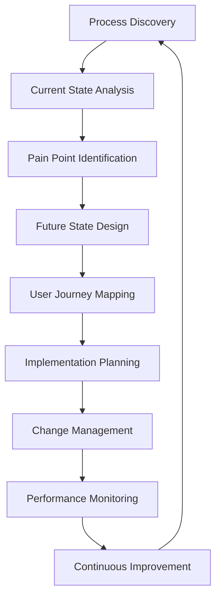

# 🔄 Process & Workflow Intelligence Experts

## Tổng quan
Chuyên gia chuyên về process design và workflow optimization - người architect các business processes hiệu quả và user-friendly workflows.

## Danh sách Quantum Experts

### 📋 Quantum Workflow Intelligence Architect
**Chuyên môn:** Process design excellence, workflow optimization, business intelligence
- Business process modeling với optimization strategies
- User journey mapping với experience design
- Workflow automation design với human-centric approaches
- Process performance measurement với continuous improvement
- Change management với stakeholder engagement

## Khi nào sử dụng

### 🎯 Process Analysis Phase
- **Workflow Architect**: Current state analysis, process discovery
- Pain point identification với bottleneck analysis
- Stakeholder requirement gathering với user research

### 🔧 Process Design Phase
- **Workflow Architect**: Future state design, workflow optimization
- User journey mapping với experience design
- Process documentation với standard operating procedures

### 🚀 Implementation Phase
- **Workflow Architect**: Change management, training design
- Process rollout coordination với stakeholder communication
- Performance monitoring setup với success metrics

### 📈 Optimization Phase
- **Workflow Architect**: Process performance analysis, improvement identification
- Continuous improvement implementation với feedback integration
- Scaling strategies với efficiency optimization

## Workflow Design Framework

## Core Capabilities

### 🔍 Process Discovery & Analysis
- **Current State Mapping**: As-is process documentation với detailed analysis
- **Stakeholder Analysis**: User roles, responsibilities, pain points identification
- **Performance Baseline**: Current metrics collection với benchmark establishment
- **Gap Analysis**: Identify inefficiencies với improvement opportunities

### 🎨 Workflow Design Excellence
- **Future State Design**: Optimized process flows với user experience focus
- **User Journey Mapping**: End-to-end experience design across touchpoints
- **Decision Points**: Logic flow design với branching scenarios
- **Exception Handling**: Error scenarios với recovery workflows

### 📊 Process Optimization
- **Efficiency Analysis**: Time, cost, quality optimization strategies
- **Automation Opportunities**: Manual task identification cho automation
- **Resource Optimization**: Workload distribution với capacity planning
- **Quality Improvement**: Error reduction strategies với quality gates

### 🎯 User Experience Design
- **Human-Centered Design**: Workflows designed cho user productivity
- **Cognitive Load Reduction**: Simplify complex processes với intuitive flows
- **Accessibility Considerations**: Inclusive process design cho all users
- **Mobile Optimization**: Mobile-friendly workflows cho modern work patterns

## Business Process Excellence

### 📋 Process Modeling Standards
- **BPMN Notation**: Business Process Model and Notation expertise
- **Swimlane Diagrams**: Cross-functional process visualization
- **Value Stream Mapping**: Lean methodology với waste identification
- **Process Hierarchies**: High-level to detailed process breakdown

### ⚡ Workflow Automation Design
- **Human-System Interaction**: Balance automation với human oversight
- **Decision Automation**: Rule-based decision points với exception handling
- **Integration Points**: System handoffs với data synchronization
- **Approval Workflows**: Multi-stage approval processes với escalation

### 📈 Performance Management
- **KPI Definition**: Process performance indicators với success metrics
- **SLA Management**: Service level agreements với performance monitoring
- **Continuous Monitoring**: Real-time process performance tracking
- **Improvement Cycles**: Regular process review với optimization cycles

## Integration với Other Experts

### Workflow ↔ UX Design
- **Collaboration**: User experience optimization, interface design
- **Deliverables**: User journey maps, interaction specifications

### Workflow ↔ Automation
- **Collaboration**: Process automation opportunities, workflow digitization
- **Deliverables**: Automation requirements, process specifications

### Workflow ↔ Business Intelligence
- **Collaboration**: Process analytics, performance measurement
- **Deliverables**: Process metrics, dashboard requirements

### Workflow ↔ Quality Assurance
- **Collaboration**: Process quality validation, testing workflows
- **Deliverables**: Quality checkpoints, validation procedures

## Process Design Methodologies

### 🔄 Lean Process Design
- **Value Stream Analysis**: Identify value-adding vs non-value-adding activities
- **Waste Elimination**: Remove redundancies, delays, unnecessary steps
- **Flow Optimization**: Smooth process flow với minimal handoffs
- **Continuous Improvement**: Kaizen approach to ongoing optimization

### 🎯 Design Thinking Approach
- **Empathy Phase**: Deep understanding của user needs và pain points
- **Define Phase**: Problem statement với opportunity identification
- **Ideate Phase**: Creative solution generation với brainstorming
- **Prototype Phase**: Rapid workflow prototyping với testing

### 📊 Data-Driven Design
- **Process Mining**: Automated process discovery từ system logs
- **Analytics Integration**: Performance data integration với decision-making
- **A/B Testing**: Process variation testing với performance comparison
- **Predictive Modeling**: Forecast process performance với optimization

## Change Management Excellence

### 🤝 Stakeholder Engagement
- **Change Champions**: Identify và empower process advocates
- **Communication Strategy**: Clear, consistent change communication
- **Training Design**: Comprehensive training programs cho new processes
- **Feedback Loops**: Continuous stakeholder feedback collection

### 📚 Knowledge Management
- **Process Documentation**: Clear, accessible process documentation
- **Best Practices**: Capture và share process excellence
- **Lessons Learned**: Document challenges và solutions
- **Continuous Learning**: Process knowledge evolution với experience

### 🎯 Adoption Strategies
- **Phased Rollout**: Gradual process implementation với risk mitigation
- **Success Metrics**: Adoption tracking với performance measurement
- **Support Systems**: Help desk, super users, ongoing support
- **Recognition Programs**: Celebrate process adoption successes

## Best Practices
1. **User-Centric Design**: Every process should serve user productivity và satisfaction
2. **Simplicity First**: Eliminate unnecessary complexity và steps
3. **Continuous Improvement**: Regular process review và optimization
4. **Data-Driven Decisions**: Use metrics to guide process improvements
5. **Change Management**: Invest in people aspects của process change
